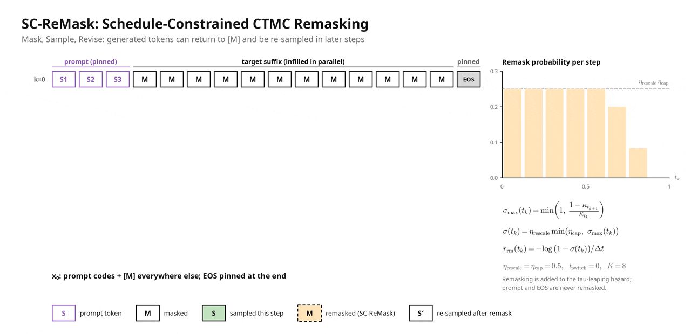

# Mask, Sample, Revise: A Revisable CTMC Inference Stack for Guided Discrete Flow Matching Text-to-Speech

[](https://arxiv.org/abs/2606.13989)
[](https://attend.ieee.org/slt-2026/)
[](https://gdflowtts.github.io/G-DFlowTTS-Demo)
[](https://huggingface.co/alefiury/G-DFlowTTS-NeuCodec-Emilia-YODAS)

Official implementation of **G-DFlowTTS (Guided Discrete Flow Matching TTS)**
and the **Mask, Sample, Revise** inference stack, accepted at the
[IEEE Spoken Language Technology Workshop (SLT 2026)](https://attend.ieee.org/slt-2026/).

G-DFlowTTS is a zero-shot, alignment-free text-to-speech model based on
**Discrete Flow Matching (DFM)**. Speech is represented as a single stream of
[NeuCodec](https://huggingface.co/neuphonic/neucodec) tokens, and synthesis is
formulated as conditional infilling: given an acoustic prompt and the text, a
Continuous-Time Markov Chain (CTMC) sampler fills in the masked target tokens
in parallel, with no duration predictor or external aligner.

<p align="center">
  
</p>

<p align="center"><em>
(a) Training: a DiT predicts masked NeuCodec tokens from the concatenated text
and speech embeddings, with prompt-matched conditional coupling.
(b) Inference: the Mask, Sample, Revise stack combines predictor-free guidance
(PFG), CTMC tau-leaping and SC-ReMask token-to-mask transitions, keeping the
acoustic prompt fixed.
</em></p>

## Highlights

**Mask, Sample, Revise** is an inference-time CTMC stack for DFM-TTS that
requires no post-hoc fine-tuning:

- **SC-ReMask (Schedule-Constrained CTMC Remasking)**: a new remasking
  strategy for Discrete Flow Matching. It adapts the remasking formulation of
  [ReMDM](https://openreview.net/forum?id=IJryQAOy0p), designed for masked
  discrete diffusion, to the CTMC formulation of DFM. Because the two
  formulations are not directly compatible, remasking is re-derived as an
  explicit token-to-mask CTMC transition whose rate is constrained by the
  probability-path schedule and added to the tau-leaping hazard. Generated
  tokens can go back to the mask state and be revised, giving good results
  with **fewer inference steps**.
- **Discrete guidance**: predictor-free guidance (PFG) combines conditional
  and unconditional CTMC rates as a geometric mixture to strengthen text
  conditioning. A single model learns both via 10% text dropout.
- **Prompt-matched conditional coupling (C-coupling)**: the training source
  sequence keeps a random-length prefix of the target, so the probability
  path matches the prompted infilling task used at inference.

### How SC-ReMask Works

<p align="center">
  
</p>

Each row is the sequence after one tau-leaping step (K = 8). The acoustic
prompt and the final EOS are pinned. At every step, masked positions are
sampled in parallel (green), and SC-ReMask sends already generated tokens
back to `[M]` (dashed orange) with probability σ(t_k), so early decisions can
be revised and re-sampled later (′). The remask probability is capped by the
schedule and decays to zero at the end of sampling, so every position is
decoded by the last step. The animation is a toy simulation with the paper's
settings (η_rescale = η_cap = 0.5, t_switch = 0).

## Results

LibriSpeech test-clean (4–10 s utterances, same-speaker prompts), 32 NFE.
Mean scores (see the paper for confidence intervals and significance tests).

| System | WER (%) ↓ | CER (%) ↓ | SIM-o ↑ | UTMOS ↑ | RTF ↓ |
|---|---|---|---|---|---|
| U-coupling baseline | 75.44 | 47.25 | 0.17 | 2.12 | 0.05 |
| C-coupling only | 90.12 | 57.79 | 0.17 | 1.80 | 0.05 |
| U-coupling + PFG | 28.61 | 16.66 | 0.33 | 2.97 | 0.10 |
| C-coupling + PFG | 18.38 | 8.96 | 0.35 | 3.17 | 0.13 |
| **C-coupling + PFG + SC-ReMask** | **8.39** | **3.56** | **0.42** | **3.77** | 0.10 |

Audio samples are available on the [demo page](https://gdflowtts.github.io/G-DFlowTTS-Demo).

## Quick start with 🤗 Transformers

```python
import soundfile as sf
from transformers import AutoModel

model = AutoModel.from_pretrained(
    "alefiury/G-DFlowTTS-NeuCodec-Emilia-YODAS",
    trust_remote_code=True,
).to("cuda")

ref_audio, sr = sf.read("reference.wav")

wav = model.synthesize(
    text="I just received wonderful news about the promotion I have been waiting for!",
    ref_audio=ref_audio,
    ref_sampling_rate=sr,
    ref_text="Kids are talking by the door.",
    steps=32,
    use_pfg=True,
    gamma=1.5,
    use_sc_remask=True,
    sc_remask_eta_rescale=0.5,
    sc_remask_eta_cap=0.5,
    sc_remask_tswitch=0.0,
    seed=0,
)

sf.write("output.wav", wav.numpy(), model.config.sampling_rate)
```

`ref_text` must be the exact transcription of the reference audio. See the
[model card](https://huggingface.co/alefiury/G-DFlowTTS-NeuCodec-Emilia-YODAS)
for all sampling options.

The same is available from the command line with `src/infer_hf.py`, which
needs only `torch`, `transformers` and `soundfile`:

```bash
python src/infer_hf.py \
  --ref_audio prompt.wav \
  --ref_text "Transcript of the prompt." \
  --text "Text to synthesize." \
  --output outputs/sample.wav
```

It accepts the same sampling arguments as `src/infer.py` (see the table in
[Inference from a checkpoint](#inference-from-a-checkpoint)), plus `--model`
to load another Hub repo or a local folder exported with `src/upload_to_hub.py`.

## Installation

The environment is managed with [uv](https://docs.astral.sh/uv/). The setup
script installs `uv` if needed, creates `.venv` and picks the right CUDA build
of PyTorch for your driver:

```bash
git clone https://github.com/alefiury/G-DFlowTTS.git
cd G-DFlowTTS
bash prepare_env.sh
source .venv/bin/activate
```

| Variable / flag | Description |
|---|---|
| `TORCH_BACKEND` | PyTorch build: `auto` (default), `cu128`, `cu126`, `cpu`, ... |
| `VENV_DIR` | Virtual environment path (default `.venv`) |
| `PYTHON_VERSION` | Python version (default `3.12`) |
| `--flash-attn` | Also build `flash-attn` (slow, needs the CUDA toolkit) |

Dependencies are listed in `requeriments.txt`. NeuCodec and the GPT-2
tokenizer are loaded through 🤗 Transformers and downloaded automatically.

## Inference from a checkpoint

Synthesize one utterance from a Lightning checkpoint with the full
Mask, Sample, Revise stack (PFG + SC-ReMask, paper defaults):

```bash
python src/infer.py \
  --config config/emilia/en-eos_as_pad-gpt2-emilia_yodas-mask-ce-poly-variable_window-c_coupling-pfg.yaml \
  --checkpoint /path/to/checkpoint.ckpt \
  --ref_audio prompt.wav \
  --ref_text "Transcript of the prompt." \
  --text "Text to synthesize." \
  --output outputs/sample.wav
```

| Argument | Default | Description |
|---|---|---|
| `--nfe` | 32 | Number of CTMC sampling steps |
| `--gamma` | 1.5 | PFG strength (`--no_pfg` disables guidance) |
| `--eta_rescale`, `--eta_cap`, `--t_switch` | 0.5, 0.5, 0.0 | SC-ReMask schedule (`--no_remask` disables it) |
| `--duration` | estimated | Target duration in seconds |
| `--speed` | 1.0 | Speaking-rate factor for the length estimate |

Without `--ref_audio`/`--ref_text`, a LibriSpeech prompt from `src/refs/` is used.

### LibriSpeech evaluation

`src/eval_librispeech.py` reproduces the paper's evaluation protocol: it
synthesizes every row of a metadata CSV for several NFE values and reports the
real-time factor. The CSV needs `text` and `ref_text` columns, plus either
precomputed NeuCodec codes (`filepath_codec`, `reference_codec`) or raw audio
paths (`target_filename`, `reference_filename`, relative to
`--audio_base_dir`), which are encoded on the fly.

```bash
python src/eval_librispeech.py \
  --config config/emilia/en-eos_as_pad-gpt2-emilia_yodas-mask-ce-poly-variable_window-c_coupling-pfg.yaml \
  --checkpoint /path/to/checkpoint.ckpt \
  --metadata_csv /path/to/LibriSpeech-test-clean-filtered.csv \
  --output_dir outputs/librispeech \
  --use_oracle_length --oracle_add_eos \
  --nsf 2,4,8,16,32,64,128 \
  --use_pfg --gamma 1.5 \
  --use_sc_remask \
  --sc_remask_eta_rescale 0.5 --sc_remask_eta_cap 0.5 --sc_remask_tswitch 0.0
```

Sampling defaults follow the paper (γ = 1.5, η_rescale = η_cap = 0.5,
t_switch = 0); guidance and remasking are enabled with `--use_pfg` and
`--use_sc_remask`. The sampler itself lives in `src/utils/sampling.py`.

## Training

Training uses PyTorch Lightning and logs to Weights & Biases.

```bash
python src/main.py \
  -c config/emilia/en-eos_as_pad-gpt2-emilia_yodas-mask-ce-poly-variable_window-c_coupling-pfg-streaming.yaml \
  -g 0
```

| Argument | Description |
|---|---|
| `-c`, `--config_path` | YAML config |
| `-g`, `--gpu` / `-gpus`, `--gpus` | Single GPU index, or a JSON list for multi-GPU DDP (e.g. `'[0,1,2,3]'`) |
| `-pc`, `--pretrained-checkpoint` | Initialize weights from a checkpoint (fresh optimizer and scheduler) |
| `--continue-training` | With `-pc`, also restore optimizer, scheduler and global step |
| `-ck`, `--checkpoint-dir` | Checkpoint output directory |

### Data

The paper model is trained on the English portion of Emilia-YODAS,
pre-encoded with NeuCodec:
[`neuphonic/emilia-yodas-english-neucodec`](https://huggingface.co/datasets/neuphonic/emilia-yodas-english-neucodec)
(CC BY 4.0). Three dataset modes are supported (`datasets.type`):

| Type | Input | Notes |
|---|---|---|
| `hf_streaming_codes` | Precomputed codes streamed from the Hub or local Parquet | No preprocessing; the dataset is gated, so accept its terms and run `hf auth login` first |
| `hf_text_tokenizer` | Local CSV with `filepath` (saved code tensors) and `text` columns | Used for the paper run |
| `hf_streaming_text_tokenizer` | Raw audio in Parquet | NeuCodec codes are extracted on the training GPU |

### Configs

All paper configs are in `config/emilia/`. The file names encode the setup:

| Component | Options |
|---|---|
| Source distribution | `mask` (used in the paper), `uniform` |
| Loss | `ce` (cross-entropy, used in the paper), `kl` (generalized KL) |
| Coupling | default (U-coupling), `c_coupling` (prompt-matched conditional coupling) |
| Guidance | `pfg`: 10% text dropout, required for PFG at inference |

The paper model uses
`en-eos_as_pad-gpt2-emilia_yodas-mask-ce-poly-variable_window-c_coupling-pfg.yaml`
(232M parameters; 12-layer DiT, 12 heads, hidden size 768; 1M steps,
effective batch size 64, AdamW with lr 3e-4 and cosine decay). The
`-streaming` variant trains on the same data streamed from the Hub.

### Fine-tuning on another language

`config/pt-tagarela-v2-streaming-finetune.yaml` fine-tunes on Brazilian
Portuguese (TAGARELA v2) from raw audio in Parquet files, using `audio` as the
waveform column and `stt_parakeet` as the text column:

```bash
python src/main.py \
  -c config/pt-tagarela-v2-streaming-finetune.yaml \
  -pc /path/to/pretrained.ckpt \
  -g 0
```

Omit `-pc` to train from scratch, or add `--continue-training` to resume an
interrupted run.

## Exporting to the Hugging Face Hub

`src/upload_to_hub.py` converts a Lightning checkpoint into a
`trust_remote_code` model repository (safetensors weights, config, tokenizer,
modeling code from `src/hub/` and model card). It checks that the exported
model's logits match the original model before uploading.

```bash
python src/upload_to_hub.py \
  -c config/emilia/en-eos_as_pad-gpt2-emilia_yodas-mask-ce-poly-variable_window-c_coupling-pfg.yaml \
  -pc /path/to/checkpoint.ckpt \
  -o exports/G-DFlowTTS \
  --repo-id <user>/<repo> --private
```

Omit `--repo-id` to export locally without uploading; add `--dtype bfloat16`
to halve the file size.

## Repository structure

```
config/                      Training configs (config/emilia/ holds the paper setups)
resources/                   Architecture figure and SC-ReMask animation
src/
├── main.py                  Training entry point
├── infer.py                 Single-utterance inference from a Lightning checkpoint
├── infer_hf.py              Single-utterance inference with 🤗 Transformers
├── eval_librispeech.py      Batch synthesis for LibriSpeech / MOS evaluation
├── upload_to_hub.py         Export to the Hugging Face Hub
├── hub/                     Standalone 🤗 Transformers model (trust_remote_code)
├── modules/
│   ├── gdflowtts/           DiT backbone, rotary embeddings, source distributions
│   └── wrappers/            Lightning training wrapper
├── dataset/                 Datasets and collators
└── utils/                   CTMC sampler (sampling.py), NeuCodec wrapper, LR schedulers
```

## Citation

```bibtex
@article{ferreira2026mask,
  title={Mask, Sample, Revise: A Revisable CTMC Inference Stack for Guided Discrete Flow Matching Text-to-Speech},
  author={Ferreira, Alef Iury Siqueira and Gris, Lucas Rafael Stefanel and Vidal, Luiz Fernando de Ara{\~A}{\v{s}}jo and de Oliveira, Frederico Santos and Shulby, Christopher Dane and Soares, Anderson da Silva and others},
  journal={arXiv preprint arXiv:2606.13989},
  year={2026}
}
```

## Acknowledgements

This work builds on [Flow Matching](https://github.com/facebookresearch/flow_matching)
by Meta, [ReMDM](https://openreview.net/forum?id=IJryQAOy0p),
[NeuCodec](https://huggingface.co/neuphonic/neucodec) and
[Emilia](https://huggingface.co/datasets/amphion/Emilia-Dataset).

## License

The pretrained weights are released under
[CC BY-NC 4.0](https://creativecommons.org/licenses/by-nc/4.0/). Parts of the
code are adapted from Meta's Flow Matching library (CC BY-NC). The training
data is CC BY 4.0, and NeuCodec is subject to its own license.
